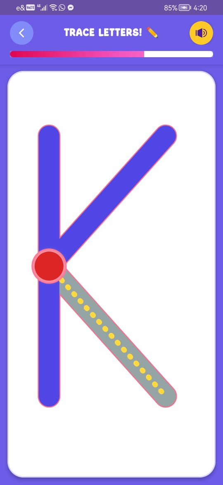

# ✏️ HatoopTracingView

<p align="center">
  
  
  
  
</p>

<p align="center">
  <b>A fun, interactive Android custom view that lets kids trace letters and numbers — finger-guided, stroke-by-stroke. 🎉</b>
</p>

---

## 🌟 What is HatoopTracingView?

**HatoopTracingView** is a custom Android View library designed to make learning fun for kids. It renders letters and numbers as traceable paths, allowing children to follow the shape using their finger. The view detects correct tracing, provides visual feedback, and supports both Latin characters and digits — making it a perfect building block for **educational apps** targeting early learners.

Whether you're building a kids' alphabet app, a handwriting practice tool, or a preschool learning platform, HatoopTracingView gives you a ready-to-use, delightful tracing experience.

---

## ✨ Features

- 🖊️ **Finger-tracing interaction** — children follow the path with their finger
- 🔤 **Letters & Numbers support** — trace A–Z and 0–9
- 🎨 **Customizable colors** — match your app's theme
- ✅ **Stroke validation** — detects correct tracing direction and path
- 🎉 **Completion feedback** — triggers a callback when tracing is done
- 📱 **Lightweight & easy to integrate** — drop-in custom view
- 🧒 **Kid-friendly UX** — large touch targets, smooth animations

---

## 📸 Screenshots

| Tracing Letters | Tracing Numbers | Completion |
|:-:|:-:|:-:|
|  |  |  |

> 💡 *Replace placeholder images above with actual screenshots from your app or emulator.*

---

## 🚀 Setup

### Step 1 — Add JitPack to your `settings.gradle.kts`

Open your **project-level** `settings.gradle.kts` and add the JitPack repository:

```kotlin
dependencyResolutionManagement {
    repositoriesMode.set(RepositoriesMode.FAIL_ON_PROJECT_REPOS)
    repositories {
        mavenCentral()
        maven { url = uri("https://jitpack.io") }
    }
}
```

### Step 2 — Add the dependency

In your **app-level** `build.gradle.kts`:

```kotlin
dependencies {
    implementation("com.github.Gamalaldin-I:HatoopTracingView:1.1.0")
}
```

Then **sync your project** with Gradle. ✅

---

## 🛠️ Usage

### In XML Layout

```xml
    <com.example.hatooptracingview.TracingView
        android:id="@+id/tracingView"
        android:layout_width="match_parent"
        android:layout_height="match_parent"
        app:thumbColor="@color/red_600"
        app:glowColor="@color/purple_light"
        app:dottedPathColor="@color/yellow_accent"
        app:activePathColor="@color/green_accent"
        app:completedPathColor="@color/purple_light"
        app:borderColor="@color/purple_light"
        app:inCompetedPathsColor="@color/gray_light"/>
```

### In Kotlin

```kotlin
    override fun onViewCreated(view: View, savedInstanceState: Bundle?) {
        super.onViewCreated(view, savedInstanceState)
        // give the letter or number to the tracing view as a string to view the tracing view of it
        //recommended setting  letter after tracing view is created
        //use this code to setup the tracing view
        binding.tracingView.post {
            binding.tracingView.setChar("A")
        }
        //get the number of paths
        vm.setPathsNumber(binding.tracingView.getPathsNumber())
        // Set up the tracing listener
        binding.tracingView.setTracingListener(object : TracingListener{
            override fun onCompleted() {
                vm.onCompleted()
            }

            override fun onCompletedPathsChange(completedPaths: Int) {
                vm.setCompletedPaths(completedPaths)
            }

            override fun onProgressChange(percentage: Int) {
                vm.setProgress(percentage)
            }

            override fun onReset() {
                vm.setCompletedPaths(0)
                vm.setProgress(0)
            }

        }
        )
    }
    fun resetTracing() {
        binding.tracingView.reset()
    }
```

---

## 🎨 Customization

| XML Attribute               | Kotlin Method              | Description                          |
|---------------------------|------------------------------|--------------------------------------|
| `app:thumbColor`          | `setThumbColor(Int)`         | Color of thumb                       |
| `app:glowColor`           | `setGlowColor(Int)`          | Color of thumb glow                  |
| `app:dottedPathColor`     | `setDottedPathColor(Int)`    | Color of the guide (dotted outline)  |
| `app:activePathColor`     | `setActivePathColor(Int)`    | Color of dotted path                 |
| `app:completedPathColor`  | `setCompletedPathColor(Int)` | Color of completed path              |
| `app:inCompetedPathsColor`| `setInCompleteColor(Int)`    | Color of incompleted path            |
| `app:borderColor`         | `setBorderColor(Int)`        | Color of border color                |


---

## 📦 Requirements

| Requirement        | Minimum Version |
|--------------------|-----------------|
| Android SDK        | API 21+         |
| Kotlin             | 1.6+            |
| Gradle             | 7.0+            |

---

## 🤝 Contributing

Contributions are welcome! Feel free to open issues, suggest features, or submit pull requests.

1. Fork the repository
2. Create your feature branch (`git checkout -b feature/amazing-feature`)
3. Commit your changes (`git commit -m 'Add amazing feature'`)
4. Push to the branch (`git push origin feature/amazing-feature`)
5. Open a Pull Request

---

## 👨‍💻 Author

**Gamal Aldin**
- GitHub: [@Gamalaldin-I](https://github.com/Gamalaldin-I)


---

<p align="center">Made with ❤️ for little learners 🧒👧</p>
